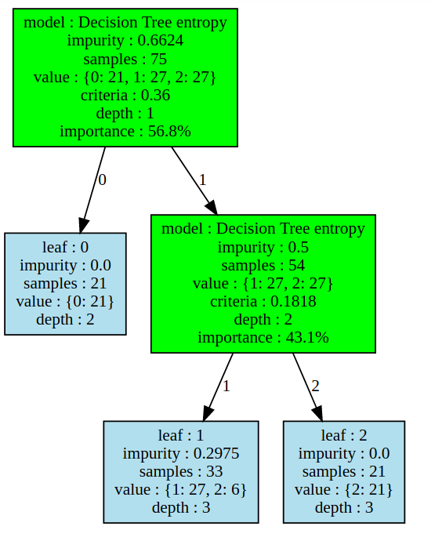

# Decision-Tree-Steroid
full implementation of decision tree with flexible impurity function and for node to be any machine learning classifier such as logistic regression, svm, as well gini and entropy impurity.
# requirements
1. numpy
2. graphviz
3. scipy
4. sklearn
# How to run ?
1. import important files and setup  
from Steroid.models import dt_classifier,dt_node  
from Steroid.criteria import gini,entropy 
from Steroid.impurity import gini_impurity,entropy_impurity 
from sklearn.tree import DecisionTreeClassifier 
from sklearn.linear_model import LogisticRegression 
2. Import data in X,y as numpy array 
from sklearn.datasets import load_iris<r>
data=load_iris() 
X=data.data 
y=data.target 
3. Initialize model 
clf=dt_classifier(no_features=[X.shape[1]], 
                criteria_models={ 
                        "Decision Tree entropy":DecisionTreeClassifier(criterion="entropy",max_depth=1,random_state=random_state), 
                                             "Logistic Regresion":LogisticRegression(C=1,solver="lbfgs",multi_class="auto",max_iter=1000), 
                                             } 
4.  fit data into model 
  clf.fit(X_train,y_train) 
5. predicting target 
  y_pred=clf.predict(X_train) 
# View graph 
graph=clf.export_graph(criteria_digits=4,show_features=False,show_value=True,show_depth=True,show_samples=True,show_leaves=True,show_criteria=True,show_model=True,show_importance=True,importance_type="percentage") 
  graph 
  
# some other screenshot of classification
  
  
